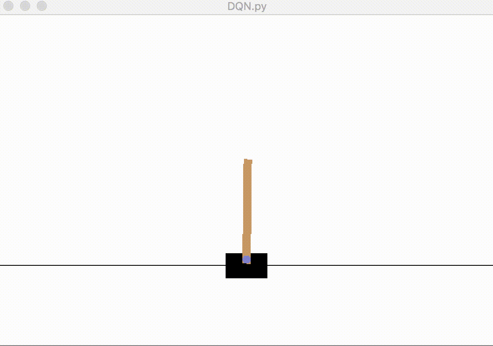
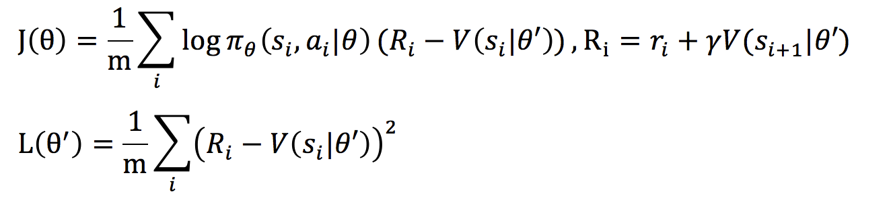
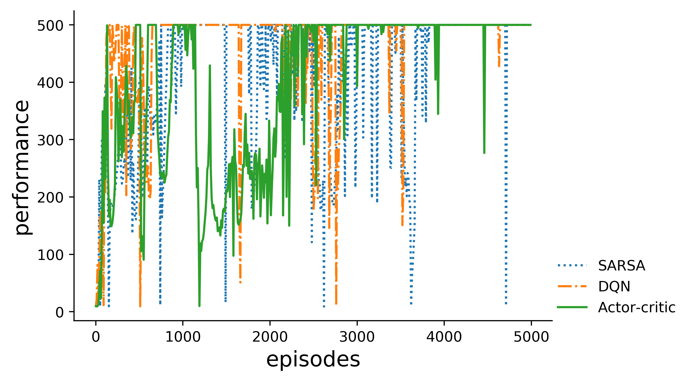
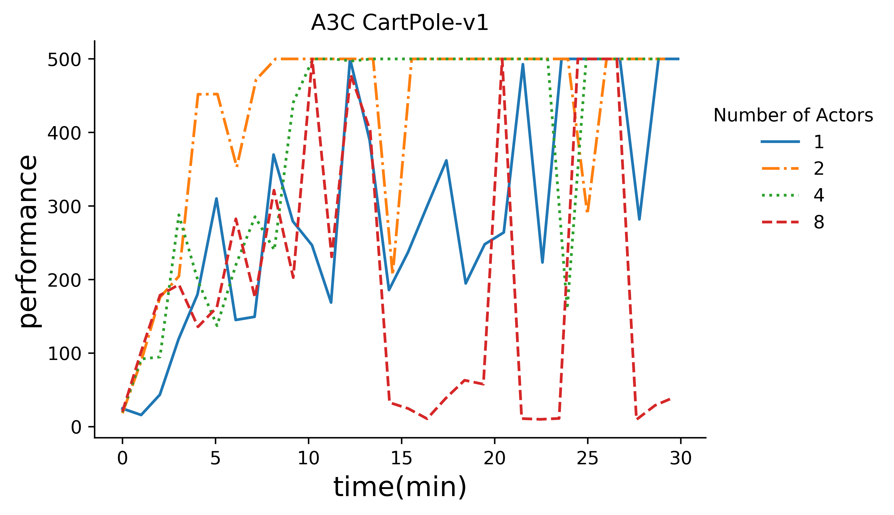
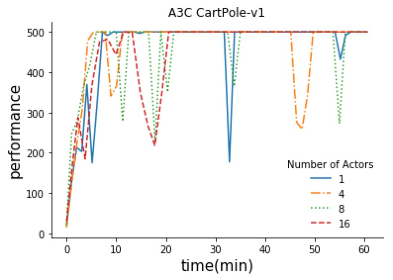

#Gym games with tensorflow

This is an example of implementing reinforcement learning (RL) algorithms in tensorlow to solve gym problems.

## DQN and SARSA
### Qnet class
The network ``Qnet`` is represented as a python class. A tensorflow session, `sess`, network input size `in_size`, network output size `out_size` and the filename `model_file` that is used to store model checkpoints are needed to build this class.
 
 + `build_model(self,in_size,out_size)`:build the tensorflow network
 + `restore(self)`:restore network from previous checkpoints, if any
 + `train(self,x_train,y_train,n=10,save=True)`:train network use `x_train` and `y_train`, if `save`is set to True, the trained model will be saved.
 + `predict(self,x_predict)`: predict output

### Game class
 The game class `game` needs a tensorflow session `sess`, game name `game` and checkpoint filename `model_file` to build. Some of its methods are explained as follows:
 
 + `get_Qsa(self,s,a)`: get the Q-value of state `s` and action `a`
 + `get_max_a(self,s,sa)`: `sa` is all possible actions at state `s`. This method returns the action `a` with max Q-value and the Q-value as a tuple.
 + `play(self,n=1000,episodes=1)`: play the game. `n` represents the maximum step per episode. `episodes` represents numer of episodes to play 

### SARSA and Q-learn
During training, an agent explores the environemnt with consecutive states, actions and rewards (s1,a1,r1,s2,a2,r2,...,st,at,rt,st+1)

Q(si,ai) is updated differently in SARSA and Q-learn

+ For SARSA: `Q(si,ai) = alpha*Q(si,ai) + (1-alpha)*(r+gamma*Q(si+1,ai+1))`
+ For Q-learn: `Q(si,ai) = alpha*Q(si,ai) + (1-alpha)*(r+gamma*max[a']Q(si+1,a'))`

SARSA and Q-learn are implemented with neural networks `Qnet`, predicting Q value from state-action (s,a) pairs. When updating parameters, `Q(si,ai)` and `max[a']Q(si+1,a')` are calculated using the network, and `Q(si,ai)` is updated according to equations above, then `[(si,ai),updated Q(si,ai)]` pairs are used to update network parameters.

A recording of `DQN` trained game is shown as follows:

## Actor-critic

In Actor-critic algorithm, there is a leaner, the actor and an critic, which resembles a teacher. 

The objective of the actor is to maximize J related to policy, and the objective of the critic is to learn value V, or to minimize L. 

In this code one `ActorCriticNet` network predicts both the policy `pi` and the value `V`. When an agent explores the environment (`AC_train`), data sets of expected reward `R`, states `s` and correspoinding actions `a` are generated. These data sets are firstly used to train the critic, then the value `V` is calculated and then again the network is trained according by the actor.
### ActorCreticNet
Similar to `Qnet`, ActorCreticNet has `bulid_model`, `train` `predict(s)` methods. An additional method is `value(s)` which predicts the value of state s.

### performances

Without experience replay, DQN, SARSA, and Actor-critic methods can reach the highest score but are not stable.
##Asynchronous methods

### A3C
The full name of A3C is Asynchronous advantage actor critic methods. The basic idea is Actor-Critic, but parameters are updated aynchronously. The algorithm is as follows:

+ There is a global copy of network parameters, build by `A3CNet`. 
+ Each of the actors (`Worker`s) uses one local copy of network `self.net` to explore the game with the `work` function.
+ After exploring, some data sets are generated to calculate the gradient of local parameters. The data sets generated are expected rewards `R`, states `s` and actions taken `a`. After calculation of local gradients, the gradients are added to the global parameters and then local parameter values are updated using global parameter values.
+ Each process update the global parameters asynchronously. Actors are implemented as a subproces using python `multiprocessing` module, while one evalutor is there to measure the performance of the global parameters perodically. 

2 and 4 actors are better than 1 actor, but when increasing to 8 actors, the performance drops.

##Notes:

according to [A3C paper](https://arxiv.org/abs/1602.01783), A3C has two advatages

+ faster, because of parallel exploring 
+ more stable, because different actors experience different environments.

Firstly A3C was implemented with python `threading`. But when implemented this way, more actors are not faster than fewer actors. Because of  [GIL](https://medium.com/@yaoyaowd/python-%E4%BD%A0%E6%80%8E%E4%B9%88%E9%82%A3%E4%B9%88%E6%85%A2-%E7%9C%8B%E7%9C%8B%E5%B9%B6%E8%A1%8C%E5%92%8C%E5%B9%B6%E5%8F%91-6a97c4828d64 "Python GIL"). 

Later `multiprocessing` module was used and this is a better implementation of A3C. The combination of `multiprocessing` and `tensorflow` was treaky and enven now I am not sure the right way of their combination. `The codes worked but I don't know why`.

